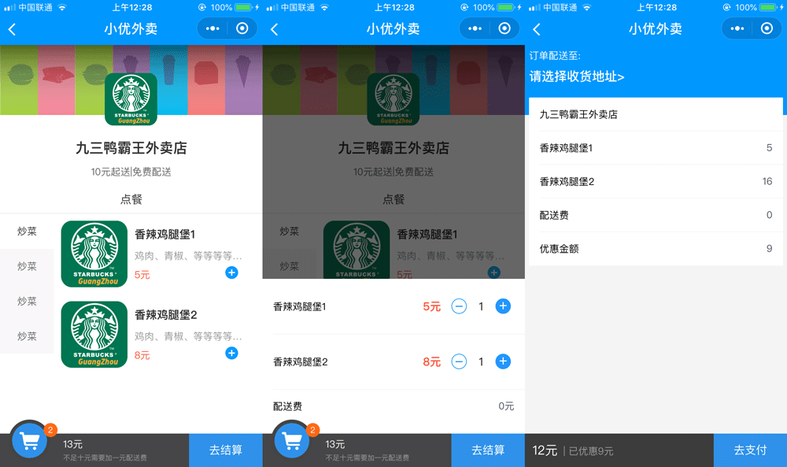
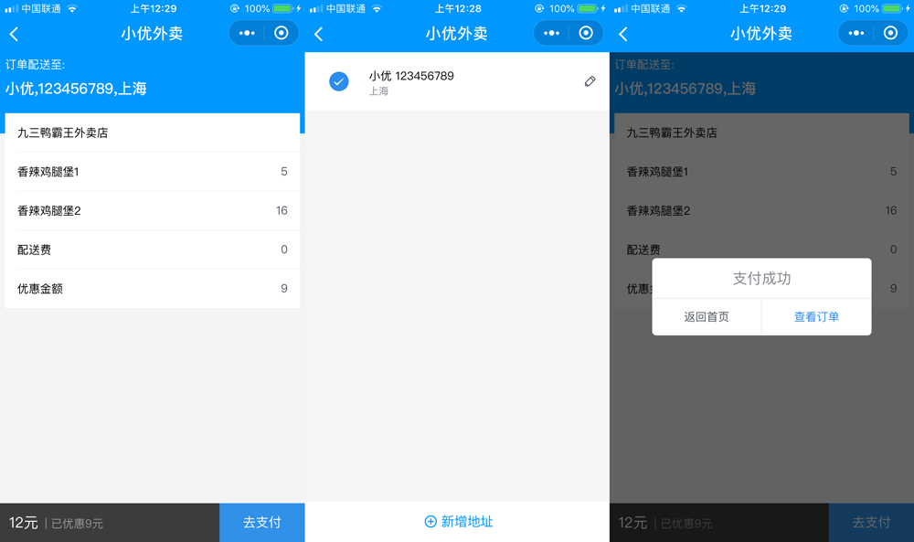
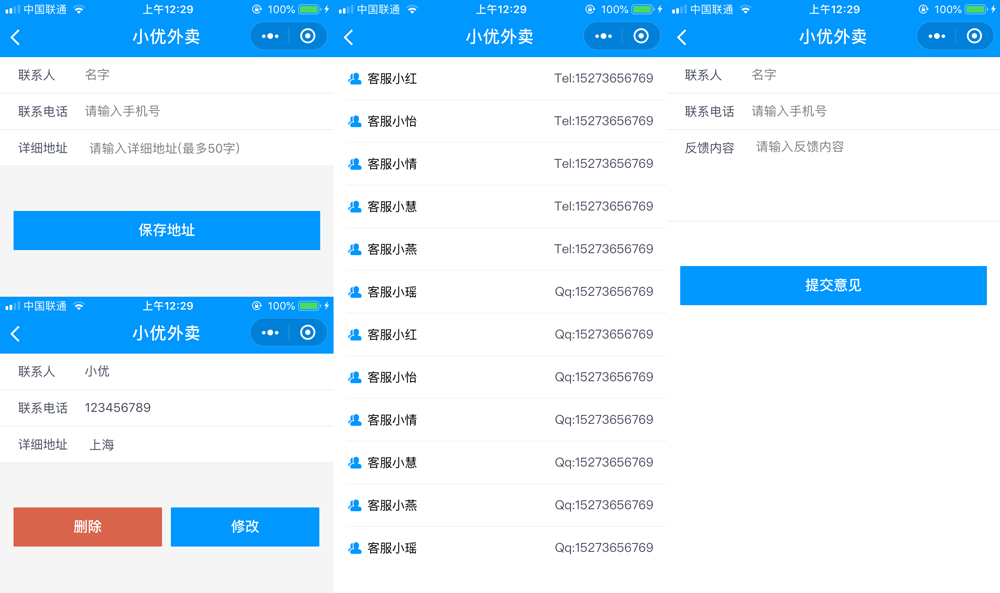

# mpvue-signin

> A Mpvue project (以前随意写的一个小东西, 现在肯定年久失修 仅供参考!!! 具体大家还是可以多看看文档哦

mpvue 写的小程序 [文章地址](https://juejin.im/post/5b940dc55188255c89010fe3) 大佬们也可以去鼓励一下哦~

同时也欢迎start和pr哦~~







##技术栈

[mpvue](http://mpvue.com/) 是一个使用 Vue.js 开发小程序的前端框架。框架基于 Vue.js......(可以看官网介绍~).

[iview weapp ](https://weapp.iviewui.com/) 一套高质量的
微信小程序 UI 组件库.

## Build Setup

``` bash
# install dependencies
npm install

# serve with hot reload at localhost:8080
npm run dev

# build for production with minification
npm run build

# build for production and view the bundle analyzer report
npm run build --report
```

For detailed explanation on how things work, checkout the [guide](http://vuejs-templates.github.io/webpack/) and [docs for vue-loader](http://vuejs.github.io/vue-loader).
